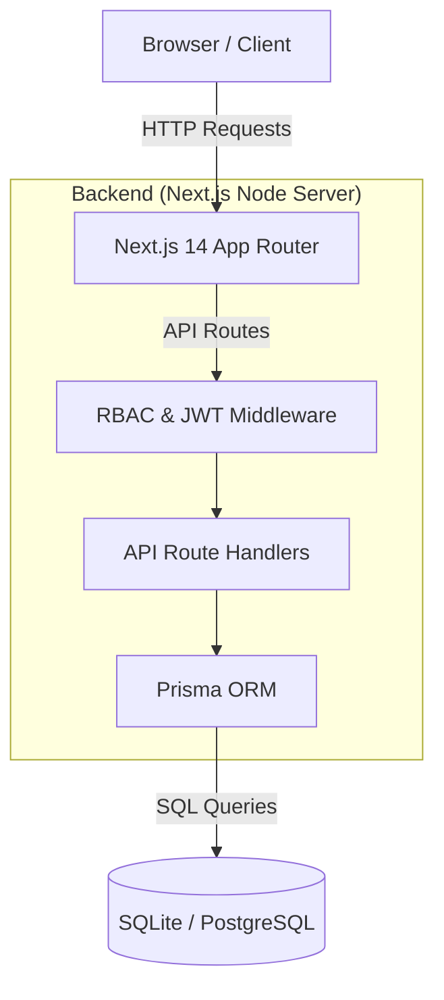
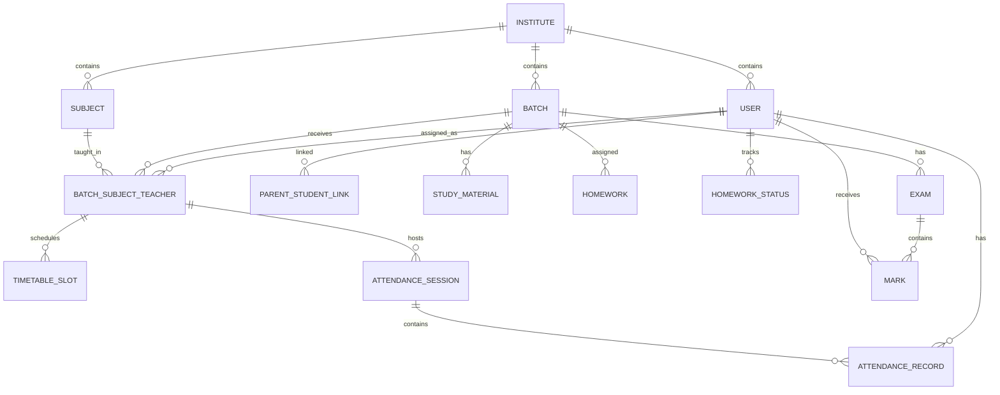

# Prabodha – Technical Project Report

**Internship Period:** May 8, 2026 – Present  
**Role:** Class 11 Computer Science Teacher & Full-Stack Web Developer  
**Project:** Prabodha (Multi-Tenant Institution Management Platform)  

---

## 1. Executive Summary

### 1.1 Internship Objective & Context
I have been working as a Class 11 Computer Science teacher and web developer at a local coaching institute since May 8. While the institute’s primary website is currently a basic landing page (index), my primary objective as a developer has been to architect, build, and deploy **Prabodha**—a highly scalable, multi-tenant SaaS platform that will eventually integrate directly with the institute’s main website.

Prabodha serves as a lightweight yet incredibly robust LMS (Learning Management System) and ERP tailored for educational institutions. The goal is to provide a platform where admins, teachers, students, and parents can seamlessly manage daily academic operations—from attendance and timetable scheduling to study materials and homework tracking.

### 1.2 Current Project Status
The project follows a strict agile roadmap and is heavily structured for a clean, modular architecture. We have successfully completed the core foundation and feature sets required for an MVP (Minimum Viable Product).

**✅ Features Completed:**
- **Core Architecture:** Next.js App Router setup with Tailwind CSS and Prisma ORM.
- **Security & Multi-Tenancy:** Custom JWT authentication, Role-Based Access Control (RBAC), and strict `instituteId` data isolation.
- **Entity Management:** CRUD APIs and UI for Batches, Subjects, Teachers, Students, and Parent-Student linking.
- **Academic Operations:** Timetable scheduling API and Attendance tracking systems (optimized for fast in-class input).
- **Content & Assessments:** Study Materials uploading/linking, Homework assignment API, and Exam Marks recording.
- **Role-Specific Dashboards:** Custom, isolated UI views for Admins, Teachers, Students, and Parents.

**🔴 Next Milestones (Polish & Deployment):**
- **UX Polish:** Adding Skeleton loaders for data-fetching and robust toast notifications for error handling.
- **Database Migration:** Transitioning the local SQLite development database to a production-grade PostgreSQL cluster.
- **Deployment:** Provisioning a VPS (Ubuntu, PM2, Nginx), configuring a domain with SSL, and going live.

---

## 2. System Architecture

### 2.1 High-Level Architecture
Prabodha uses a modern, monolithic serverless architecture powered by **Next.js 14**. It utilizes the **App Router** for both React Server Components (UI) and Next.js Route Handlers (API). 



### 2.2 Request Lifecycle & Authentication Flow
Prabodha avoids cookies to prevent CSRF issues across subdomains and instead uses **localStorage** for JWT tokens. Every request follows a strict lifecycle:

1. **Client Action:** User triggers a `fetch()` call. The `apiFetch` utility automatically attaches the JWT from `localStorage` as `Authorization: Bearer <token>`.
2. **Middleware Interception:** The API route invokes the `apiHandler` wrapper.
3. **Authentication:** `requireAuth(request)` decodes the JWT and validates the signature. If invalid, it throws a `401 Unauthorized` exception.
4. **Authorization:** `requireRole(user, 'admin')` verifies the user's role. If invalid, it throws a `403 Forbidden` exception.
5. **Database Query:** The route handler interacts with Prisma. Crucially, **every single database query includes a `where: { instituteId: user.instituteId }` clause** to enforce strict multi-tenant isolation.
6. **Response:** Data is returned as JSON. `apiHandler` automatically catches Prisma errors (like unique constraint violations) and formats them into clean HTTP responses.

---

## 3. Database Analysis

### 3.1 Entity Relationship (ER) Diagram



### 3.2 Design Decisions & Normalization
The schema is designed in **3rd Normal Form (3NF)** to eliminate data redundancy.
- **The Golden Rule:** Every single table contains an `instituteId` foreign key. This ensures data from different coaching centers can safely coexist in the same database.
- **The Junction Table (`BatchSubjectTeacher`):** Instead of complex many-to-many arrays, Prabodha uses a dedicated junction model. One row means *"Teacher X teaches Subject Y to Batch Z"*. This single table cascades downwards to power the Timetable and Attendance systems seamlessly.
- **Soft Deletes:** Users (Teachers/Students) are never deleted via `DELETE` statements. Instead, `isActive = false` is used. This prevents foreign key constraint crashes on historical attendance and marks records.

---

## 4. API Documentation

*Prabodha has over 17 core REST API endpoints. Below are key examples.*

### 4.1 Authentication: POST `/api/auth/login`
- **Purpose:** Authenticates a user and returns a JWT.
- **Request Body:**
  ```json
  {
    "email": "teacher@prabodha.local",
    "password": "password123"
  }
  ```
- **Response (200 OK):**
  ```json
  {
    "token": "eyJhbGciOiJIUzI1...",
    "user": {
      "id": "cuid_123",
      "role": "teacher",
      "name": "John Doe",
      "instituteId": "inst_1"
    }
  }
  ```
- **Security:** Validates bcrypt hash.

### 4.2 Entity Creation: POST `/api/batches`
- **Purpose:** Creates a new batch/classroom.
- **Headers:** `Authorization: Bearer <token>`
- **Request Body:**
  ```json
  { "name": "Class 11 Science" }
  ```
- **Response (201 Created):**
  ```json
  { "id": "batch_123", "name": "Class 11 Science", "instituteId": "inst_1" }
  ```
- **Validation:** Zod schema enforces `name` length and type. Enforces `admin` role via RBAC.

### 4.3 Data Retrieval: GET `/api/attendance/[id]`
- **Purpose:** Retrieves a specific attendance session and its student records.
- **Headers:** `Authorization: Bearer <token>`
- **Response (200 OK):**
  ```json
  {
    "id": "session_1",
    "sessionDate": "2026-08-01T00:00:00Z",
    "records": [
      { "studentId": "std_1", "status": "present" }
    ]
  }
  ```

---

## 5. Security & Data Protection

### 5.1 How Prabodha is Secured
1. **SQL Injection:** By using Prisma ORM, raw SQL strings are never concatenated. Prisma automatically parameterizes all queries, making SQL injection mathematically impossible.
2. **Cross-Site Scripting (XSS):** React automatically sanitizes and escapes all variables rendered in JSX, neutralizing malicious script tags stored in the database.
3. **Cross-Site Request Forgery (CSRF):** Because authentication relies on custom HTTP headers (`Authorization: Bearer`) instead of cookies, browsers will not automatically attach credentials to forged cross-origin requests.
4. **Password Cryptography:** Passwords are never stored in plain text. They are hashed using **bcrypt** with a strong salt round before insertion.
5. **Data Isolation:** The custom `apiHandler` wrapper and `requireAuth` logic guarantee that an API route will physically crash if a developer forgets to scope a Prisma query by `instituteId`.

---

## 6. Scalability Strategy

While currently using SQLite for local development, the system is designed to scale to hundreds of institutes.

### 6.1 Database Scaling
- **Phase 1 (PostgreSQL):** Before launch, the schema will migrate to PostgreSQL. It supports concurrent writes, essential for morning attendance rushes.
- **Phase 2 (Read Replicas):** 90% of traffic on an LMS is read-heavy (students viewing timetables, parents viewing marks). We can route `Prisma` read operations to database read-replicas while keeping writes on the primary node.

### 6.2 Application Scaling
- **Stateless Architecture:** Because JWTs are used for sessions, the Next.js server is entirely stateless. We can spin up 10 identical Node.js servers behind an Nginx Load Balancer, and any server can handle any request.
- **Caching:** In the future, Redis can be introduced to cache timetable and syllabus data, reducing database hits to zero for static information.

---

## 7. Technology Stack Rationale

- **Next.js 14:** Chosen to combine frontend routing and backend APIs into a single repository (monorepo). It drastically speeds up development compared to managing separate React and Express repositories.
- **Prisma ORM:** Chosen for absolute type safety. If the database schema changes, TypeScript will immediately throw errors across the entire codebase where the old schema was used, preventing runtime crashes.
- **Tailwind CSS:** Allows for rapid, component-scoped styling without managing messy global CSS files.
- **Zod:** Chosen for bulletproof API request validation.

---

## 8. Mentor Q&A (System Design Interview Prep)

Here is a prepared script to confidently answer technical questions from your mentor or future interviewers:

**Q: Explain your project in 2 minutes.**
> *"Prabodha is a multi-tenant SaaS platform built to handle the academic and operational workload of educational institutes. As an intern and developer at my coaching center, I built this using Next.js, Prisma, and Tailwind. It securely isolates data by institute, handles RBAC for admins, teachers, and parents, and manages everything from dynamic timetables and attendance to study materials and grading."*

**Q: Why did you use Next.js instead of a separate React and Express backend?**
> *"Development speed and maintenance. Next.js App Router allows me to write React Server Components and backend API Route Handlers in the same folder structure. It shares TypeScript types seamlessly between the frontend and backend, entirely eliminating the need for complex API syncing."*

**Q: How does authentication work? Session vs JWT?**
> *"I chose JWTs over server-side sessions. When a user logs in, the server generates a cryptographically signed JSON Web Token. The server doesn't have to remember the session in RAM or the database, which makes our backend completely stateless and infinitely scalable. The client passes this token in the `Authorization` header on every request."*

**Q: How many concurrent users can it handle? What if 1,000 students log in at once?**
> *"Node.js is asynchronous and event-driven. A standard VPS running Next.js can easily handle thousands of concurrent connections. The bottleneck would be the database. Because we use Prisma, we can easily set up connection pooling to manage the database threads, ensuring that an attendance rush doesn't crash the database."*

**Q: Why did you design the schema this way?**
> *"The schema revolves around the `BatchSubjectTeacher` junction table. Instead of wildly linking students to teachers, I realized that all academic logic stems from one fact: 'Teacher X teaches Subject Y to Batch Z'. By making that a dedicated table, I can cleanly attach timetable slots and attendance sessions to that specific relationship."*

---

## 9. Future Roadmap

Once the V1 MVP is deployed, the architectural foundation allows for rapid expansion:
1. **Payment Gateway Integration:** Integrating Razorpay/Stripe to track student fee installments automatically.
2. **Dedicated Mobile App (React Native):** Utilizing the exact same REST APIs built in Next.js to power a native parent communication app.
3. **AI Analytics:** Integrating LLMs to analyze student exam marks over time and automatically generate "Weak Subject Area" reports for parents.
4. **Online Examinations:** A locked-down testing portal for multiple-choice quizzes that auto-grade into the Marks table.
